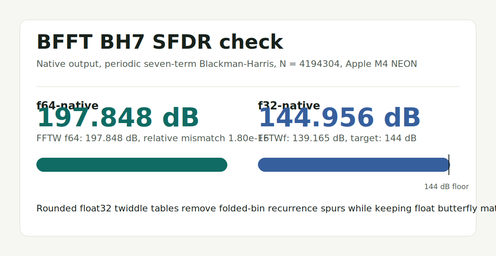

# BFFT 


BFFT is a small C/C++ real FFT library based on a normalized-basis Bruun transform.
This trivialization conceals that this approach, among all FFT, might be optimal.
It also conceals that it is 33% lighter on memory and up to 3x faster than other libraries.
Invertibility is stable and guaranteed. SFDR tracks FFTW in double precision and meets the current native float32 BH7 target.

The key point is that the algorithmic coordinate system is faster before optimization enters the conversation. Bruun’s route produces a native spectral representation with less necessary layout work than a conventional standard-order FFT. The optimized implementation then amplifies that advantage with SIMD, fused tails, heap-optimized native order, and cache-conscious scheduling, but the root advantage is not merely AVX or NEON.

Bruun supplied the theoretical doorway: real-coefficient factor trees, paired conjugate roots, and the forward transform idea. But the thing we are calling BFFT is not simply “Bruun, implemented.” It is the result of a reconstruction and a sequence of additional discoveries, some actually similar to work in the literature already: Chinese remainder theorem framing, exact inverse, coefficient ladder, normalized local-complex basis, cache/depth-first scheduling, fused scatter versus two-phase output policy, and residue-domain usage where the complex FFT chart disappears. 

Our normalized-basis move is especially not “just Bruun.” It changes the leaf representation from r0 + r1 z to r0 + r1 e, with e = (z - cos(alpha)) / sin(alpha) and e² = -1, which makes every nontrivial leaf into a local complex plane and makes standard bin conversion free at the leaf-coordinate level: X[k].re = r0, X[k].im = -r1.

BFFT’s native layout is the natural fast coordinate system. Standard FFT order is provided by a final N/2-bin conversion. That conversion is comparable to the layout work other FFTs perform internally, while native output exposes the lower-cost path directly. Experimenting further yields that the rearrangement follows rules:

```
 For a transform of size N = 2^L, let M = N/2 and let W = log2(M) = L - 1. The nontrivial complex bins are indexed by native positions pos = 1..M-1. Each native position belongs to a dyadic shell

s = floor(log2(pos)).

The same shell is also the shell of the BFFT leaf index m, so floor(log2(m)) = s. Within a shell, the mapping from native position to Bruun leaf is fixed by simple bit rules. Write bit(x,b) for bit b of x, and write

gray(pos) = pos ^ (pos >> 1).

Then the leaf index m = NATIVE_LEAF[pos] is given by these rules. The shell bit is always set:

m_s = 1.

For shell s = 0, this is the whole value, so m = 1. For shell s = 1, the low bit is

m_0 = 1 ^ bit(pos,0),

and m_1 = 1. For all shells s >= 2, the low bit is

m_0 = 1 ^ bit(pos - 1, 1),

the interior bits are the Gray-code bits of the native position,

m_b = bit(gray(pos), b) for 1 <= b <= s - 2,

and the bit immediately below the shell anchor is

m_{s-1} = 1 ^ bit(pos, s - 1).

All bits above s are zero. This gives the complete native-position-to-Bruun-leaf map without consulting NATIVE_LEAF.

The second half of the rearrangement maps that Bruun leaf to the ordinary FFT bin k. Let

a = W - 1 - s

be the destination anchor bit, and let

p0 = bit(pos,0).

Then the standard FFT bin k = IDX[m] is also determined by fixed shell rules. The anchor bit is always set:

k_a = 1.

If s >= 1, the next bit is

k_{a+1} = 1 ^ p0.

For the middle triangular field,

k_j = p0 ^ bit(pos, W - j) for a + 2 <= j <= W - 3.

For the two high bits, when they exist,

k_{W-2} = 1 ^ bit(m - 1, 1) for s >= 3,

and

k_{W-1} = 1 ^ bit(pos - 1, 1) for s >= 2.

All bits below the anchor are zero. Together, these equations give the full native-position-to-standard-bin route:

pos -> m -> k.

```

The native layout remains the “true” fast path; standard FFT order remains an interoperability layer. The important discovery is that BFFT is not hiding chaos behind native order. It has a mathematically regular native-to-standard map, and the current implementation chooses the fastest known way to realize that map in memory.

## Current scope

- Power-of-two real transforms with `N >= 4`.
- Standard FFT-order real-to-complex output (`0..N/2`) for everyday use.
- Standard FFT-order magnitude-only output for amplitude pipelines that do not
  need phase or complex scratch buffers.
- Heap-optimized native spectrum order for performance-oriented code.
- Double-precision and single-precision transform entry points.
- Residue-domain transforms and filters for pipelines that can avoid spectrum
  permutation entirely.
- Linux `make`, `make test`, and `make install` workflow.

## Policy summary

- The Makefile probes the host compiler and enables AVX2/FMA when available.
- The kernel selects AVX-512, AVX2/FMA, SSE2, NEON, or scalar from the compiler
  target macros.
- Native spectrum output keeps heap-optimized ordering and fused scatter.
- Standard FFT-order output uses fused scatter plus conversion by default.
- Standard FFT-order output uses the internal two-phase pack only for large
  transforms: `N > 8192` on AVX-class builds and `N > 1048576` on SSE2/NEON
  builds. Scalar builds keep the fused path.

## Build

```sh
make
make test
```

CMake builds are also supported:

```sh
cmake -S . -B build-cmake
cmake --build build-cmake
ctest --test-dir build-cmake --output-on-failure
```

CMake enables the same host SIMD probe as the Makefile on x86_64 when the compiler accepts `-mavx2 -mfma`. Optional comparison probes are built by default. The library comparison probe dynamically uses FFTW when `libfftw3` is available, and its CMake target also enables an Intel IPP complex-DFT reference when `ipps.h`, `ipps`, `ippvm`, and `ippcore` are found. CMake also enables the benchmark's PFFFT comparison path when `pffft.h` and `libpffft` are found.

A first GitHub Actions workflow is tracked in `.github/workflows/ci.yml`. It runs the Makefile and CMake build/test/install paths on Ubuntu. See `TODO_HUMAN.md` for the repository-operator checklist for enabling the workflow, reading failures, and requiring CI before merges.

The benchmark can optionally compare against Intel oneMKL DFTI without adding
a build-time dependency. Install an Intel MKL package that provides
`libmkl_rt.so`, then pass `--intel-mkl` to `build/examples/benchmark`; the
program loads `libmkl_rt` dynamically and adds `MKL64_ns`, `MKL32_ns`,
`S/MKL`, `F32/M`, `mkl64`, and `mkl32` printouts. If `libmkl_rt` cannot be
loaded, those columns remain `n/a`.

Artifacts are written to `build/`:

- `build/libbfft.a`
- `build/libbfft.so`
- `build/examples/benchmark`
- `build/examples/c_api_demo`
- `build/examples/cpp_api_demo`

## Install

```sh
sudo make install PREFIX=/usr/local
```

For packaging, stage an install with `DESTDIR`:

```sh
make install DESTDIR=/tmp/bfft-package PREFIX=/usr
```

Installed files:

- `${PREFIX}/include/bfft/bfft.h`
- `${PREFIX}/include/bfft/bfft.hpp`
- `${PREFIX}/lib/libbfft.a`
- `${PREFIX}/lib/libbfft.so`
- `${PREFIX}/lib/pkgconfig/bfft.pc` when installing with the Makefile or CMake
- `${PREFIX}/lib/cmake/bfft/BFFTConfig.cmake` when installing with CMake
- `${PREFIX}/lib/cmake/bfft/BFFTConfigVersion.cmake` when installing with CMake
- `${PREFIX}/lib/cmake/bfft/BFFTTargets.cmake` when installing with CMake


## Package discovery

After installation, `pkg-config` consumers can compile with:

```sh
cc app.c $(pkg-config --cflags --libs bfft)
```

CMake consumers can use the installed package config:

```cmake
find_package(BFFT CONFIG REQUIRED)
add_executable(app app.cpp)
target_link_libraries(app PRIVATE bfft::static)
```

If the shared library was built and installed by CMake, `bfft::shared` is also available.

## Minimal C example

```c
#include <bfft/bfft.h>

#include <stdlib.h>

bfft_plan* plan = NULL;
bfft_status status = bfft_plan_create(1024, &plan);
if (status != BFFT_OK) {
    return 1;
}

double* input = calloc(bfft_plan_size(plan), sizeof(double));
double* work = calloc(bfft_plan_work_size(plan), sizeof(double));
bfft_complex* output = calloc(bfft_plan_bins(plan), sizeof(bfft_complex));
bfft_complex* scratch = calloc(bfft_plan_native_scratch_size(plan), sizeof(bfft_complex));

bfft_forward(plan, input, output, work, scratch);
free(input);
free(work);
free(output);
free(scratch);
bfft_plan_destroy(plan);
```

## Minimal C++ example

```cpp
#include <bfft/bfft.hpp>

#include <vector>

bfft::plan plan(1024);
std::vector<double> input(plan.size());
std::vector<double> work(plan.work_size());
std::vector<bfft::complex> output(plan.bins());
std::vector<bfft::complex> scratch(plan.native_scratch_size());

plan.forward(input.data(), output.data(), work.data(), scratch.data());
```

For amplitude-only analysis, use `bfft_forward_magnitude` or
`plan.forward_magnitude(...)` with a real output buffer sized to `plan.bins()`.
Those calls produce standard FFT-order `abs(X[k])` values without allocating a
complex spectrum or native complex scratch.

Run a complete benchmark/demo:

```sh
./build/examples/benchmark 4096 200
./build/examples/c_api_demo
./build/examples/cpp_api_demo
```

Build the optional comparison probes from the tracked `tests/` sources:

```sh
make probes
./build/tests/bfft_fftw_sfdr_bh7_probe 16 8 8 bh7 f32-native
./build/tests/bfft_library_compare_probe 12
```

`bfft_library_compare_probe` reports which external FFT references are available in the current environment. The Makefile build always compiles the probe without hard dependencies and uses FFTW dynamically when present. The CMake build additionally links Intel IPP into that probe when the IPP headers and libraries are discoverable, usually through normal search paths or `IPPROOT`.

The BH7 probe modes are `f64-standard`, `f64-native`, `f32-standard`, and
`f32-native`. For float32 BFFT modes the probe uses FFTWf when `libfftw3f` is
available, and falls back to the double-precision FFTW reference otherwise.
The CSV includes an `fftw_precision` column so mixed-precision and same-precision
runs are explicit.

## Precision behavior snapshot



These numbers were measured on an Apple M4 NEON build on 2026-06-11 with:

```sh
make probes
build/tests/bfft_fftw_sfdr_bh7_probe 22 8 22 bh7 f64-native
build/tests/bfft_fftw_sfdr_bh7_probe 22 8 22 bh7 f32-native
```

The probe uses periodic seven-term Blackman-Harris tones, samples eight eligible
bins at `N = 4194304`, measures both sine and cosine waves, excludes the BH7
main lobe, and reports the worst row.

| Mode | Reference | Target | BFFT SFDR | Reference SFDR | BFFT/reference rel |
| --- | --- | ---: | ---: | ---: | ---: |
| `f64-native` | FFTW f64 | FFTW parity | 197.84799575 dB | 197.84799573 dB | 1.79549659e-16 |
| `f32-native` | FFTWf f32 | 144 dB | 144.95579274 dB | 139.16529588 dB | 1.13742277e-07 |

The float32 path keeps float buffers, float spectra, and float butterfly math.
It avoids the folded-bin BH7 spur by using plan-owned float32 twiddle tables
generated once with explicit `float(...)` rounding, rather than multiplicative
float twiddle recurrence inside the transform loop.

Stats on a mac M4 circa june 10, 2026:
NOTE: PFFT is in single precision(FLOAT). BFFT, FFTW both in double precision! Emphasis!
```
 ./benchmark 
BFFT power-of-two RFFT benchmark. backend: neon-128, version: 0.1.0
standard policy is plan-dependent; FFTW uses FFTW_ESTIMATE-style flag 64 for cheap large plans.
PFFFT enabled at compile time.
       N    iters     FFTW_ns    PFFFT_ns   Native_ns      Std_ns       RT_ns      S/F      S/P  checks
     512    39062       712.4       558.7       402.3       481.3      1082.8    0.676    0.862 err 3.1e-14 rt 4.4e-16 
    1024    17578      1079.2      1179.7       917.5      1256.6      2973.6    1.164    1.065 err 4.1e-14 rt 5.6e-16
    2048     7990      2654.0      2928.9      2056.4      2483.8      5905.1    0.936    0.848 err 1.3e-13 rt 6.7e-16 
    4096     3662      6618.2      6430.8      4747.8      6456.6     13648.7    0.976    1.004 err 2.3e-13 rt 7.8e-16 
    8192     1690     15318.8     14211.8     12125.4     13293.1     30017.7    0.868    0.935 err 2.8e-13 rt 8.9e-16 
   16384      784     38201.2     32084.9     26303.6     36789.8     71612.0    0.963    1.147 err 5.3e-13 rt 8.9e-16 
   32768      366    147808.4     78035.5     58441.0    104420.0    176708.6    0.706    1.338 err 9.1e-13 rt 1.0e-15 
   65536      171    293935.7    161829.7    114029.5    226329.2    383899.1    0.770    1.399 err 1.8e-12 rt 1.0e-15 
  131072       80    607913.0    353377.1    262272.4    474334.4    812113.5    0.780    1.342 err 7.3e-12 rt 1.2e-15 
  262144       38   1230474.8    630536.2    482247.8    883182.0   1551019.7    0.718    1.401 err 1.7e-11 rt 1.3e-15
  524288       18   3499483.8   1375446.8   1029078.7   1874041.7   3325539.3    0.536    1.362 err 3.3e-11 rt 1.8e-15
 1048576       16   5347307.3   3054125.0   2370174.5   4150580.7   7686513.0    0.776    1.359 err 5.2e-11 rt 1.3e-15
 2097152       16  15257802.1   6906973.9   5443234.4   6718890.6  15186445.3    0.440    0.973 err 1.4e-10 rt 1.4e-15
 4194304       16  32542421.9  13991317.8  10658794.2  16630325.5  38184638.0    0.511    1.189 err 2.3e-10 rt 1.7e-15 
 8388608       16  63470611.9  33416458.4  23672627.6  36526708.3  82451247.4    0.575    1.093 err 4.5e-10 rt 1.8e-15 
16777216       16 141920934.9  68376585.9  49968817.7  76313549.5 180578921.9    0.538    1.116 err 4.6e-10 rt 1.9e-15 
33554432       16 293059072.9 144221557.3 101204882.8 159033716.1 344409419.2    0.543    1.103 err 2.3e-09 rt 2.1e-15 
67108864       16 649294807.3 293690114.6 208606065.1 378288268.2 747649476.6    0.583    1.288 err 2.4e-09 rt 2.0e-15

```

## Documentation

- [Public API guide](docs/api.md)
- [Architecture and policy notes](docs/architecture.md)
- [Maintainer notes for GitHub settings](docs/maintainer-notes.md)
- [Release checklist](docs/release-checklist.md)

## License

MIT. See [LICENSE](LICENSE).

We dedicate this work in the name of our God, who is both merciful and just,
and of his son, the Anointed One, Jesus Christ of Nazareth. 
May this work bless you and may the Kingdom come, and his will be done.

Baruch kevod elohei shamayim ha-elyonim mimkomo
Eloheinu shebashamayim yached shimcha v'kayeim malchutecha tamid umloch aleinu le'olam va'ed
