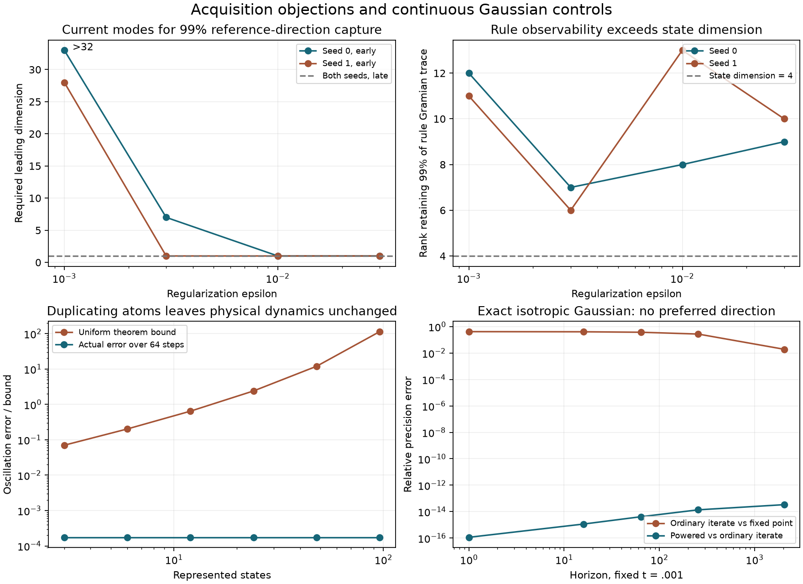

# Testing the objections: acquisition, dimension, and Gaussian structure

This follow-up tests the previously unmeasured points raised in the Claude
exchange and the user's question about Gaussianity. The earlier Temple
counterexample and finite-energy identity were already tested; they are not
counted as new evidence. The new results change the interpretation in both
directions: early cluster acquisition and the coarse radius certificate are
worse than the conjecture needs, but approximate history prediction and
transport smoothing are more promising than a blanket impossibility claim.

## Experimental scope

The main screen has eight 128-point problems: the original two seeds, at
regularization epsilon=.03,.01,.003,.001. A separate density screen has six
problems: one nested two-dimensional cloud at 64,128,256 points and epsilon
.003,.001, with unchanged centers and cost normalization. These are Gaussian
**kernels with mixture-like marginal weights**, not Gaussian probability laws.

Each trajectory is sampled at the first crossings of residual oscillation
below .1,.01,.001 times its initial value. Unlike the earlier acquisition
experiment, anchor placement does not use the future run length. Dense spectra
and a converged fixed point are used for scoring and explicitly oracle
constructions. None of these results supplies a runtime acquisition method.

`results/theory/claude_objections.json` retains all 14 cases and 42 anchors.
`probe_claude_objections.py` generates them; tests compare the rule-output
matrix with independently evaluated bilinear derivatives, the observability
Gramian with both sequential and binary sums, and nested sample geometry.

## 1. Does the required cluster stay small?

Not reliably at early anchors. We measure capture in the fixed-point weighted
metric. A reference cluster is orthonormalized and capture is the **smallest
squared singular value** of its projection into the current leading subspace.
Thus 99% capture means every unit direction of that reference cluster is
captured, not just an average or its easiest vector.

For the single fixed-point leading direction at n=128:

| epsilon | Seed 0, early anchor | Seed 1, early anchor | Both late anchors |
|---:|---:|---:|---:|
| .03 | 1 | 1 | 1 |
| .01 | 1 | 1 | 1 |
| .003 | 7 | 1 | 1 |
| .001 | More than 32 | 28 | 1 |

Entries are the smallest tested current leading dimension attaining 99%
capture. At epsilon=.001, the early reference clusters of size two and four
also fail to reach 99% within 32 current modes for both seeds. At the middle
anchor, a four-dimensional reference cluster needs 19 and 8 current modes.
At the late anchor, both need four.

This supports the objection to a uniformly tiny cluster across the acquisition
window. It does not show that an optimally chosen non-spectral representation
needs these dimensions, or that every kernel follows this trend. No spectral
crossing is inferred from this capture test.

## 2. Does state-and-rule observability need more than state dimension?

Yes, for the tested output families. At the fixed point we form all first-order
rule outputs G_ij[h]=2<vi,B(h,vj)>_c for the top r reference directions. In
nonconstant eigen-coordinates the Gramian is evaluated exactly for the frozen
linear model using geometric sums. Horizon H=ceil(1/(1-lambda_1)); none of the
retained cases reaches the safety cap of 4096.

For r=4 at n=128, keeping 99% of the rule Gramian trace needs 6–13 directions
across the eight problems, versus four for the state coordinates alone.
Keeping 99.9% needs 12–23. At epsilon=.001 the rule-only ranks are 12 and 11
at 99%, and 21 and 23 at 99.9%. The weighted joint state/rule output has
smaller ranks in some cases because its chosen state component dilutes rule
loss. It must not replace the rule-only check without an application-specific
output tolerance.

These are **Gramian trace ranks**, not worst-case relative output guarantees.
The JSON also records a relative spectral cutoff and the invariance defect of
the selected subspace. All such compressed predictions would still need a
closure-defect bound. Exact generic observability rank is not being claimed
small, and no power law in epsilon is established by four values.

## 3. Is history acquisition defeated by vanishing excitation?

Not categorically. We gave history fitting a favorable signal: the exact
linearized fixed-point rule drift

    s_j = sum_i gamma_i alpha_i lambda_i^j.

This removes moving-anchor error, eigenvalue-label changes, and error in the
reference eigenvalues. It tests whether temporal compression itself is
plausible, not whether an actual measured Ritz history is sufficient.

Fit a linear recurrence using 32 observations; predict 32 held-out values.
Orders 2,4,8 are tested with consecutive samples and with spacing approximately
one tenth of a relaxation time. Three seeded noise realizations are retained
for relative noise levels 1e-8 and 1e-6; the noise scale is the RMS over the
full 64-value scoring window. This is a diagnostic convention, not an
observable rule for choosing a noise level online.

For consecutive samples and an order-eight recurrence:

| Noise/window RMS | Resolved cases | Median worst-seed relative future RMS error | Maximum |
|---:|---:|---:|---:|
| 0 | 24/24 | 3.27e-6 | .00472 |
| 1e-8 | 21/24 | .000107 | .00962 |
| 1e-6 | 21/24 | .00119 | .03046 |

A case is called resolved when future-signal RMS is at least ten times the
injected noise RMS. Relative errors against a future signal already below
noise can be enormous and are not evidence of a large absolute prediction
failure. The JSON retains window-normalized errors too. At noise 1e-6, the
worst window-normalized order-eight error over all consecutive cases is .0151.
Order four is weaker: even without noise one of 24 consecutive cases exceeds
10% relative future error. Order two fails that criterion in eight cases.

Across early-to-late anchors, the rule signal loses roughly one to two orders
of magnitude. Acquisition timing therefore matters at any fixed absolute noise
floor, but this experiment **does not reject a modest history representation**.
It gives it a favorable oracle baseline that a real moving-rule acquisition
method must now match. No recurrence stability or held-out accuracy certificate
is supplied by the least-squares fit.
Acquiring 32 observations has a cost, and spaced observations span 31 times
the stride before prediction even begins. These favorable fits do not establish
that the acquisition interval can be amortized by a subsequent skip.

## 4. Is the c_min radius bound useful in the actual band?

The objection is confirmed for the small-regularization cases. At the late
n=128 epsilon=.001 anchors, the uniform bound is approximately 10^14.93 and
10^7.21, while the measured second-jet errors over the next 64 steps are
5.33e-4 and 6.81e-5. Early errors themselves can be large, so this is not
merely a certificate problem everywhere. At the early epsilon=.001 anchors,
measured errors are about 129 and 46; the quadratic model is not a useful
small-error approximation there.

The theorem remains mathematically valid. These observations reject using
its current c_min radius conversion as a practical certificate in this band.
The fixed point and initial displacement used in this test are known only to
the scoring oracle, making this an optimistic check of usability.

## 5. Does smoothing improve on the raw dimension constant?

There is encouraging, limited evidence. We compute the exact centered norm

    ||J^j-Pi_constant||_{c,2 -> infinity}
      = max_x sqrt(sum_i lambda_i^(2j) v_i(x)^2).

At epsilon=.003 and step 8, the nested-cloud values are 2.94,2.71,3.00 for
n=64,128,256, while 1/sqrt(c_min) rises from 16.33 to 33.39. At epsilon=.001,
the same step-eight values are 6.82,5.56,7.38. Physical smoothing appears much
less sensitive to sample count than the worst-case mass conversion.

This does not prove a dimension-free estimate, a Gaussian heat-kernel bound,
or the epsilon^(-d/2) scaling suggested in the dialogue. There is one nested
cloud, only two scales, and an impulse-response certificate would have to
control short-time contributions as well as late smoothing.

The separate duplicated-atom control in `refinement_objection.json` is an
exact conceptual falsifier of treating raw c_min as intrinsic difficulty:
repeat every atom and its transition pattern, dividing its mass among copies.
For identical lifted displacements, the actual evolution, conditional energy,
and one-step centered smoothing norm are unchanged. The c_min-based theorem
bound nevertheless deteriorates. This is representation dependence of a
coarse norm conversion: the bound increases from 0.0704 to 114 while the
observed error remains 1.75e-4. This is not proof that uniform sup-norm control is available
for arbitrary low-mass states.

## 6. Does the cost remain plausible?

We timed only supplied-basis quadratic construction and dense binary powering
of the lift plus a quadratic ledger. The basis, conditional geometry, radius
certificate, rejected proposals, and acceptance checks are excluded. This is
an optimistic partial cost for this specific implementation, not a universal
lower bound on all possible implementations.

At n=128, expressed in ordinary full log-Sinkhorn steps of the same NumPy
reference backend:

| Retained dimension | Lift dimension | Partial equivalent steps |
|---:|---:|---:|
| 1 | 2 | .8–.9 |
| 2 | 6 | 2.1–2.2 |
| 4 | 20 | 6.9–7.2 |
| 8 | 72 | 25.9–28.9 |
| 16 | 272 | 168–319 |

The tested one-relaxation-time horizons are 3–107 steps. Dimension 16 exceeds
that horizon's ordinary cost in every case even before acquisition. Dimension
8 can be plausible at the smallest epsilon, but often loses for larger
regularization. This strengthens the cost objection to an indiscriminately
expanded quadratic cluster. Longer accepted horizons, sparse tensors, or a
smaller realization could change the comparison; none is measured here.
There is no complete accelerator to compare end-to-end with the frozen-rule
control, so that stronger performance question remains untested.

## 7. Truly Gaussian problems and directional cues

Gaussianity of a distance kernel is not Gaussianity of the full problem. The
main point-cloud experiments have multimodal marginal weights and finite
support. To answer the user's question without that conflation, the new
Gaussian controls use **continuous centered Gaussian marginals** with known
covariances A,B and kernel exp(-|x-y|²/(2t)). They have no discretization or
sample-induced preferred direction.

For the scaling v(y)=exp(-y^T V y/2), let p=I/t+V. Completing the Gaussian
integrals gives the exact full-step recurrence

    p_next = B^(-1) + (t² A^(-1) + p^(-1))^(-1).

With T=t² A^(-1), this is a matrix fractional map:

    p_next = [(I+B^(-1)T)p+B^(-1)] [Tp+I]^(-1).

It has a 2d-dimensional block representation in physical dimension d.
In the isotropic case A=aI,B=bI, it reduces to the scalar map

    p_next = [(1+t²/(ab))p+1/b] / [(t²/a)p+1].

Every spatial direction is equivalent, yet a 2-by-2 matrix power advances
arbitrarily many exact mathematical iterations at fixed t. A closed-form
fixed point is also available. If R=A^(1/2), then

    F = (R B R + t² I/4)^(1/2) - t I/2,
    p_star = R F^(-1) R / t.

The row-normalized coupling has cross covariance C=A p^(-1)/t and target
covariance p^(-1)+p^(-1)A p^(-1)/t². This supplies an independent marginal
check of p_star. These facts belong to established Gaussian entropic transport,
not a new discovery: see [Janati et al.](https://arxiv.org/abs/2006.02572) and
[Akyildiz, Del Moral, and Miguez](https://arxiv.org/abs/2412.18432).

The probe tests three covariance families in dimension two (isotropic,
commuting anisotropic, and rotated/noncommuting anisotropic), at t=1,.1,.01,
.001 and horizons 1,16,64,256,2048. All 12 closed-form target covariances match
to relative error below 7.2e-16. In the isotropic t=.001 case the two linear
spatial eigenvalues coincide at .99929314: there is no distinguished leading
spatial direction. Nevertheless the powered scalar recurrence agrees with
2048 ordinary covariance iterations to relative error 3.36e-14, using 13 block
multiplications. The ordinary iterate is still about 1.91% from its limiting
precision, which is directly available from the closed form.

The generic block-power prototype has an important numerical failure:
normalizing the whole block matrix does not prevent relative invariant
subspaces from being lost. At rotated anisotropic t=1, horizon 64, its relative
error is 6.75 and its denominator condition number is about 9.4e17. A commuting
t=1 run becomes singular at horizon 2048. These failures are retained, not
excluded. The exact fractional representation is valid; this naive floating-
point implementation is not uniformly stable. The closed-form covariance
check continues to succeed. A production finite-horizon matrix recurrence
would require numerical stabilization.

Thus **isotropy can make a selected directional cue uninformative, but does
not restrict acceleration to annealing**. In this Gaussian family the
covariance/precision is the sufficient representation. Annealing changes t
along a continuation path; the formulas above keep the target t fixed.
Gaussian marginals need not be isotropic, and anisotropic or displaced Gaussian
problems can carry directional information. Nor does Gaussianity force
cumulants of an arbitrary nonlinear observable to vanish.

## Resulting interpretation

The concrete obstacles are early acquisition of a useful subspace, finite
radius certification, and the quadratic growth of this particular lift's
cost. The experiments do not support rejecting all history-based acceleration
or claiming that annealing is uniquely viable. Gaussian structure provides a
counterexample to the latter. For general kernels, the live question remains
whether a faithful, inexpensive representation of the changing rule can be
acquired and certified while there is still enough useful evolution left.

Render with `python -m experiments.entropic_transport_closure.report_claude_objections`
in a Matplotlib environment. Mini reproduction commands are in root `AGENTS.md`.

Validation: 29 tests passed in the combined existing/theory/Gaussian suite on
the M4 Mini; after adding the duplicate-atom invariant, all five focused
objection tests passed, covering 30 distinct tests in total. Retained floating-
point probes are numerical evidence, not outward-rounded certificates.
