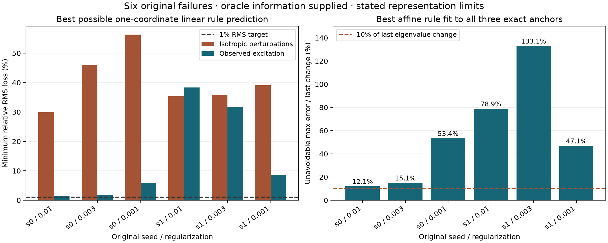

# A directional limit for the failed scalar acquisition model

The six retained scalar acquisition cases fail for a reason that is partly
representational, not merely imperfect measurement. This note establishes two
precise obstructions: a directional-capture limit for specified linear rule
prediction tasks, and an exact three-anchor lower bound for the actual scalar
affine rule ansatz. It does **not** establish that the transport problems are
unsolvable, that no useful direction exists, or that every accelerator fails.
Ordinary Sinkhorn converged on all six original problems.

## 1. Which failed problem is being tested?

The input is the unchanged `results/theory/acquisition_input.json`: n=128,
seeds 0 and 1, regularization epsilon=.01,.003,.001, and the original three
anchors in each trajectory. The reference convergence counts reproduce the
original 274,919,3053 and 178,566,1656 steps. No new mixture family is substituted.
The original model used a single slow-mode amplitude a and the rule

    theta(a) = lambda_star + 2 beta a.

It estimated the two coefficients at anchors one and two, then predicted
anchor three. The experiment also used that model for a proposed future skip.
The large inferred skip lengths at epsilon=.001 were 705 and 408, although
the fixed-point relaxation horizons ceil(1/(1-lambda_1)) were 107 and 54.
We retain both horizons rather than treating the mistaken inferred gap as
truth.

The fixed point, exact amplitudes, and dense spectra below are **scoring
oracles**. Their construction is not a proposed acquisition algorithm. Every
actual trajectory step from the original first through third anchor is used
in the finite activity ensemble, including both endpoints with equal weights.

## 2. The directional law and its prediction meaning

For weighted vectors g_i in a common metric, let M=sum_i w_i g_i g_i^T.
For an orthogonal rank-r projector P,

    captured fraction = tr(P M)/tr(M)
                      <= (lambda_1+...+lambda_r)/tr(M)
                      <= r/d_eff,
    d_eff = tr(M)/lambda_1.

The first upper bound is attained by the leading eigenspace. The second is
weaker but gives the simple necessary condition r >= eta d_eff for capture
eta. The associated root-mean-square loss is sqrt(1-capture). In particular,
**99% squared-activity capture permits 10% RMS loss**, not 1%. A 1% RMS target
requires 99.99% capture. Precision requirements must be stated explicitly.

For the changing rule, use c-orthonormal nonconstant eigen-coordinates at the
fixed point. Write Lambda=diag(lambda_i), h_{j+1}=Lambda h_j. The leading
reference-mode rule derivative is

    O_k = 2 <v_1, B(v_k,v_1)>_c,
    s_j = O Lambda^j h.

This predicts the first-order change of the reference-mode rule; it does not
assume the current leading eigenvalue follows the same branch far from the
fixed point. Stack the outputs through horizon H:

    T_H = [O; O Lambda; ...; O Lambda^(H-1)],
    W_H = T_H^T T_H.

For any linear encoder R of dimension r and any linear stacked decoder D,
rank(DR)<=r. The best possible relative squared Frobenius approximation error
of T_H is

    min_rank(A)<=r ||T_H-A||_F² / ||T_H||_F²
      = 1 - (lambda_1(W_H)+...+lambda_r(W_H))/tr(W_H).

This is the same directional law. Equivalently it is the minimum mean squared
output error over input perturbations with identity covariance in the stated
fixed-point metric, divided by mean squared target output. It is a ratio of
averages, not an average of per-input relative errors or a worst-case bound.
It even allows the decoder's time dependence to be freely chosen; requiring
closed autonomous dynamics can only make this approximation problem harder.
An arbitrary nonlinear encoder or decoder is outside this rank argument.

For the full r_ref-by-r_ref reference rule block, O contains all
2<vi,B(v_k,vj)>_c with i,j<=r_ref; output norm is ordinary Frobenius norm in
this orthonormal reference basis. This gives a specified, reproducible meaning
to 'the directions needed to carry the changing rule.' It is not simply the
number of marginal mixture components.

## 3. Bound evaluated on the original six cases

At the true fixed-point relaxation horizon, for the scalar rule output:

| Seed | epsilon | Best one-direction capture, isotropic input | Minimum relative RMS loss | Directions for 1% RMS |
|---:|---:|---:|---:|---:|
| 0 | .01 | 91.02% | 29.97% | 4 |
| 0 | .003 | 78.80% | 46.04% | 5 |
| 0 | .001 | 68.24% | 56.36% | 6 |
| 1 | .01 | 87.51% | 35.34% | 4 |
| 1 | .003 | 87.16% | 35.83% | 5 |
| 1 | .001 | 84.67% | 39.15% | 6 |

These are optimized over all input directions, not restricted to the leading
state eigenvector. Thus a one-dimensional **linear** representation cannot
meet high accuracy for this family of nearby perturbations even with its best
direction handed to it. For the four-by-four rule block, the 1% RMS dimensions
are 19,25,29 and 24,24,34 respectively.

This conclusion is conditional on the perturbation ensemble. An isotropic
input probes directions the actual trajectory may hardly visit. We therefore
repeat the bound with the empirical excitation covariance

    Sigma = mean_k alpha_k alpha_k^T,

where alpha_k are the actual state displacements from the fixed point at every
step between the original first and third anchors. For that ensemble, replace
W_H by Sigma^(1/2) W_H Sigma^(1/2). Its trace equals the average frozen-linear
future-output energy of those initial displacements. The same singular-value
bound applies to T_H Sigma^(1/2).

| Seed | epsilon | Best scalar capture, actual excitation | Minimum relative RMS loss | Directions for 1% RMS |
|---:|---:|---:|---:|---:|
| 0 | .01 | 99.976% | 1.54% | 2 |
| 0 | .003 | 99.965% | 1.86% | 2 |
| 0 | .001 | 99.663% | 5.80% | 3 |
| 1 | .01 | 85.291% | 38.35% | 3 |
| 1 | .003 | 89.922% | 31.75% | 3 |
| 1 | .001 | 99.267% | 8.56% | 3 |

This second table uses observed excitation but still predicts **frozen
first-order future rule evolution**, not the exact nonlinear future. It is
more favorable to compression than the isotropic-input table. An alternative
unit-direction weighting is also retained, so early large amplitudes do not
silently define the only possible notion of importance. Its 1% RMS dimensions
for the scalar rule are also two or three on these cases.

The correct finding is not that these trajectories fill all 127 nonconstant
state directions. In fact, their best single state direction captures
98.27–99.44% of amplitude-weighted displacement activity, and one or two state
directions capture 99%. The actual four-by-four rule-change trajectories also
reach 99% activity capture in one or two directions. A geometrically narrow
path can nevertheless have a changing temporal rule that is not a closed
scalar affine law. A static low-rank picture does not prove dynamical closure.

## 4. An exact obstruction for the scalar law that actually failed

The previous section states a linearized representation limit. The following
calculation directly tests the original ansatz on its three actual nonlinear
anchors, without a perturbation prior or a first-order approximation.

Let a_i be the exact reference slow-mode amplitudes and theta_i the exact
current leading eigenvalues. Define

    w = (a_2-a_3, a_3-a_1, a_1-a_2).

Then w.1=w.a=0. For any intercept b and slope s,

    w.theta = w.[theta-(b+s a)].

The triangle inequality gives

    max_i |theta_i-b-s a_i| >= |w.theta| / ||w||_1.          (1)

This lower bound is attained: choose residuals
sign(w.theta) sign(w_i) |w.theta|/||w||_1. Subtracting them makes the three
points collinear. Thus (1) is the **exact best possible uniform error** of
any affine scalar rule across the three anchors, even when both parameters
are chosen using all three anchors rather than only the first two.

| Seed | epsilon | Exact minimum maximum eigenvalue error | As fraction of the last observed eigenvalue change |
|---:|---:|---:|---:|
| 0 | .01 | 6.69e-5 | 12.09% |
| 0 | .003 | 6.64e-5 | 15.07% |
| 0 | .001 | .002526 | 53.40% |
| 1 | .01 | .0007832 | 78.89% |
| 1 | .003 | .0002380 | 133.07% |
| 1 | .001 | .007345 | 47.05% |

Therefore no choice of the two scalar-law parameters can fit all three exact
anchors within 10% of the last observed change on **any** of the six cases.
The 10% tolerance is an illustrative explicit threshold, not a retroactive
claim about an original acceptance test. Equation (1) and the unnormalized
error column let any desired tolerance be assessed.

If instead we keep the original procedure of fitting the first two anchors,
but supply exact amplitudes and exact leading eigenvalues, the held-out errors
are 29.3%,36.6%,129.4% and 190.9%,324.2%,116.2% of the last observed change.
Perfect acquisition alone does not repair the model.

We also repeat the affine fit using the smoothly labeled fixed-reference
Rayleigh quantity <v1,J(y)v1>_c, avoiding the decision to label the current top
eigenvalue as the same mode. Its held-out fit still fails on these anchors.
Thus changing the mode label is not by itself a complete repair. This does not
separate all causes: nonlinear curvature and mixed-mode forcing both contribute.

## 5. Limits of what has been established

* Equation (1) rejects the specified affine dependence on the exact reference
  slow amplitude. It does not reject every possible scalar coordinate or a
  nonlinear scalar rule. Three points in a high-dimensional state space can
  always be insufficient to rule out alternative encodings.
* The spectral prediction limits concern specified metrics, ensembles,
  horizons, and linear encoders/decoders. They are not universal computational
  lower bounds, nor a proof that annealing is the only viable accelerator.
* The optimum Gramian directions need not form an invariant subspace. The
  retained oracle replays compare full-space propagation of an optimally
  projected initial state with closed Galerkin evolution; their errors can
  differ substantially. Capture alone does not authorize a skip.
* Actual excitation is highly concentrated. At 1% RMS, the scalar rule's
  empirical-excitation rank is only two or three. These cases do not establish
  inevitable near-full dimension. They motivate testing a modest richer rule
  representation rather than claiming the entire problem has no direction.
* The mixture weights and component counts are not swept here. Reducing kernel
  scale exposes different conditional structure, but these measurements do
  not prove monotonicity in mixture count, marginal entropy, or epsilon.

The defensible conclusion is that the **one-mode affine changing-rule model
was under-specified at the required accuracy**. We have both a quantitative
linear directional budget and a directly attained lower bound on its exact
three-anchor fit. The remaining possibility is a richer, inexpensive model;
its acquisition, closure, finite nonlinear error, and total cost still have
to be demonstrated.

## Reproduction and validation

`probe_directional_limit.py` generates `results/theory/directional_limit.json`.
`test_directional_limit.py` checks the isotropic tight case, aligned-mixture
counterexample, rotation invariance, cancellation identity, exact projection
loss, excitation weighting, temporal observability, and attainment of the
three-point minimax bound. All five tests passed on the M4 Mini. The formulas
are exact-arithmetic statements; evaluations of the real problems are
floating-point scoring diagnostics, not outward-rounded certificates.

Root `AGENTS.md` contains the Mini commands. Render the retained figure with
`python -m experiments.entropic_transport_closure.report_directional_limit`
in a Matplotlib environment.

